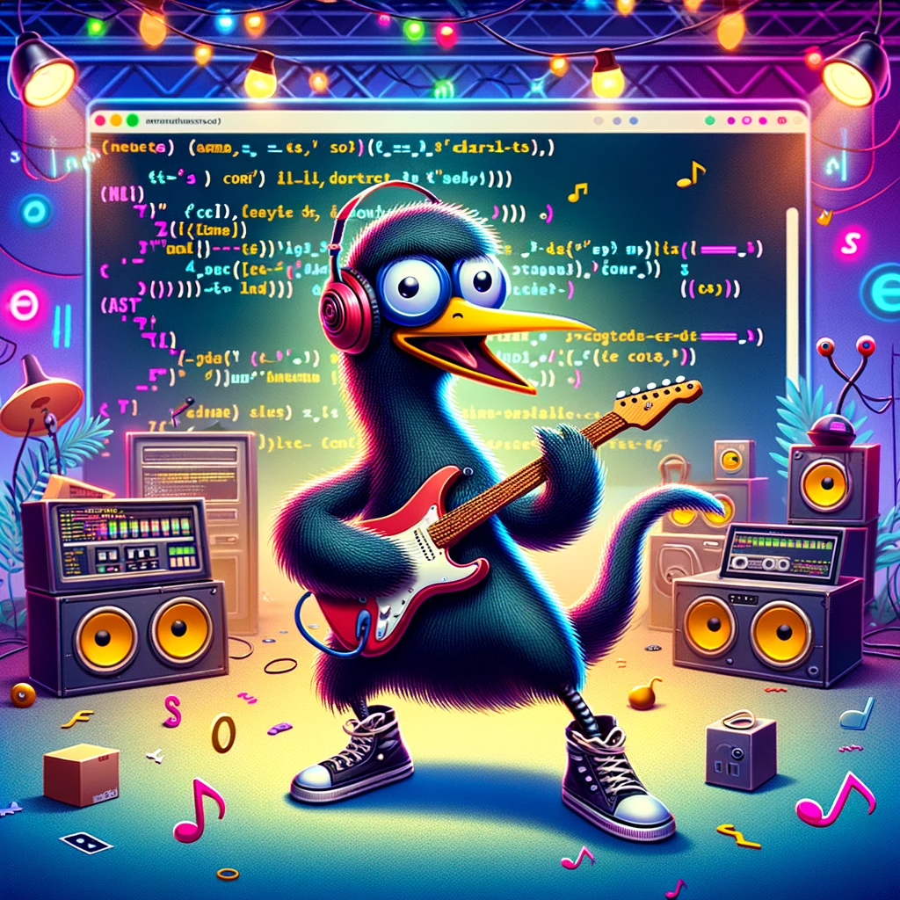
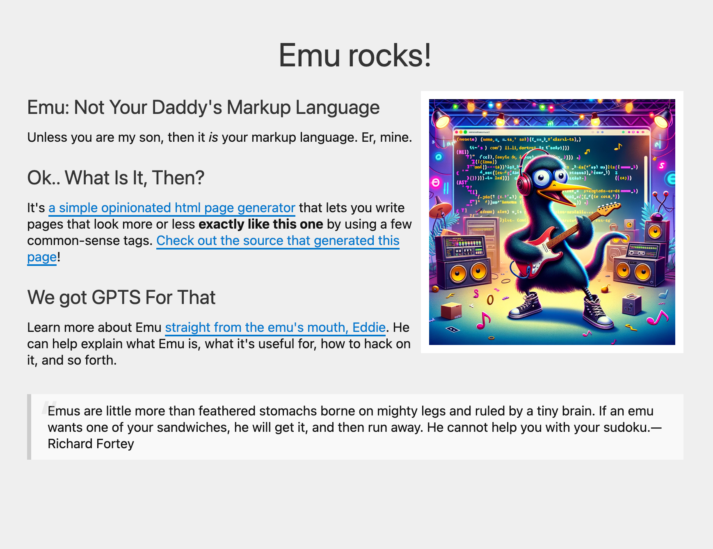

# [Emu rocks](https://emu.rocks)!<sup>*</sup>

<sup>*</sup> It actually doesn't but that's ok


#### This is a dumb "language" and not useful. This is the disclaimer as well as the advertisement.

Pros:
  * It's free
  * It has a funny bird for a mascot
  * It's okay for writing something like a blog post that is very plain

Cons:
  * It's not very good
  * There aren't really instructions on how to set it up
  * It's not blazing fast
  * Markdown is infinitely superior


The concept is you can use the option key (⌥) and letters that are easy to recall:

| Key Combination | Symbol | Description                        | Example Usage                                        |
|-----------------|--------|------------------------------------|------------------------------------------------------|
| Option-B        | ∫      | Bold tagging                       | `∫bold text∫` → **bold text**                        |
| Option-I        | ˆ      | Italicized tagging                 | `ˆitalicized textˆ` → *italicized text*              |
| Option-L        | ¬      | Link tagging (with optional title) | `¬link text\|url¬` → [link text](url)                |
|                 |        |                                    | `¬link text\|url\|title¬` → [link text](url "title") |

You can also surround words with brackets to denote the heading level:

```[This is a level one header]```
```[[[This is an H3]]]```

...and curly brackets for blockquotes:

```{This is a blockquote}```
```{{This is a nested blockquote}}```

This is what it looks like when you write it:

---

```
[The Majestic World of Emus]

[[Emus: The Unsung Heroes of the Bird World]]
Did you know that emus are the ∫second-largest living birds∫ by height, right after their distant cousin, the ostrich? Unlike ostriches, though, emus have a quirky sense of humor, often seen ¬wearing sunglasses on sunny days|erichamiter.com|Go check out my home page!¬. They're ˆcoolˆ like that.

[[[Why Emus Rock? Literally]]]
Emus have a unique passion for small shiny objects. It's not uncommon to find an emu admiring ¬a rock|emu.rocks|Emu rocks! It doesn't really but that's okay!¬, thinking it's a ∫long-lost treasure∫. Maybe they're onto something we don't know?

[[[Emus in Pop Culture]]]]
Emus have made their mark everywhere. Remember that famous emu band from the 80s, "The Beak Boys"? They were known for their hit single, "ˆSquawk This Wayˆ." Emus in sunglasses playing electric guitars... now that's something!

[[[Emu Fashion and You]]]
Emus are ˆsurprisingly fashionableˆ. They were the ¬original influencers of feathered boas|google.com¬. Who knew these birds could strut the runway ∫better than most models∫?

{Emus also have a deep philosophical side.}
{{They often ponder over the meaning of life, usually concluding that it involves finding more shiny rocks.}}

[[Conclusion: Emus, Our Feathered Overlords]]
In conclusion, emus aren't just giant birds; they're icons of humor and style. As we celebrate their awesomeness, let's not forget the age-old emu proverb: "If you can't fly, run; if you can't run, walk; if you can't walk, just look cool doing whatever you're doing." Wise words from our feathered friends.
```

---

This is what it looks like when you read it:


